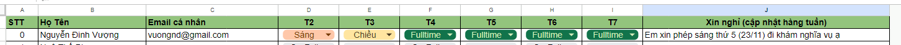
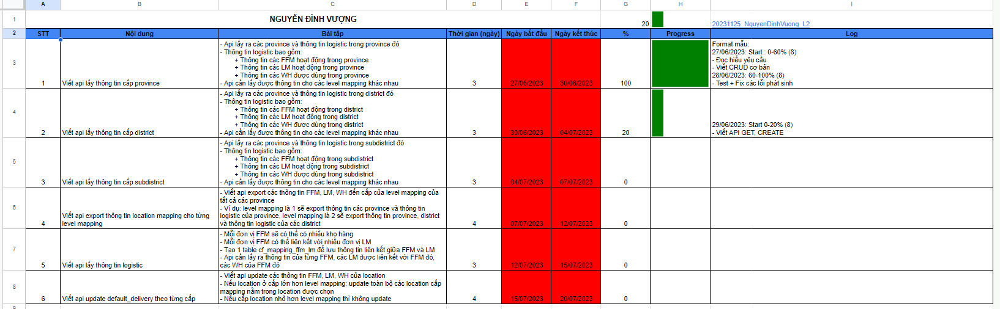
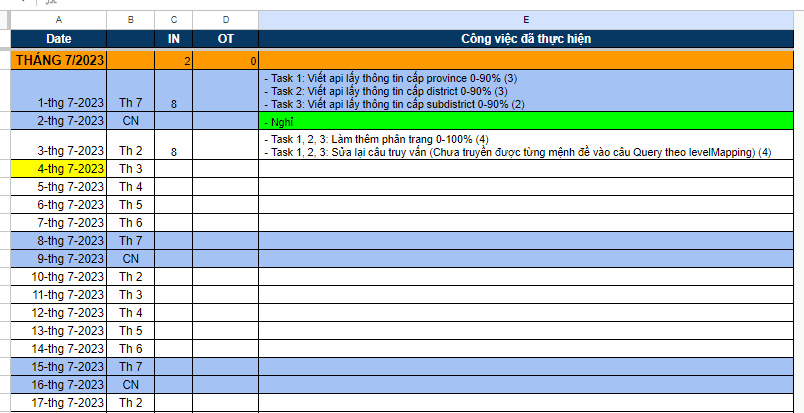

# L2 OCT

## Yêu cầu để Pass L2

1. Yêu cầu bài toán + Clean code
   1. Đảm bảo đúng yêu cầu bài toán
   2. Tuân thủ coding convention
      - [Quy tắc đặt tên](https://docs.google.com/spreadsheets/d/1ugPqWFeDqKNVJO4l2b_fSRr5zlM-dCTm/edit?pli=1#gid=1540109876)
      - [Java cơ bản](https://docs.google.com/spreadsheets/d/1ugPqWFeDqKNVJO4l2b_fSRr5zlM-dCTm/edit?pli=1#gid=487040203)
      - [Java nâng cao](https://docs.google.com/spreadsheets/d/1ugPqWFeDqKNVJO4l2b_fSRr5zlM-dCTm/edit?pli=1#gid=885795763)
   3. Tuân thủ các quy tắc clean code cơ bản
      
        Yêu cầu đọc, hiểu, làm theo như tài liệu [Clean code](https://gitlab.oceantech.com.vn/training/L2/-/tree/master/documents)
   4. Không có code smell
2. Sql cơ bản

      Hiểu và thao tác được với các câu lệnh sql cơ bản:
      - SELECT
      - INSERT
      - UPDATE
      - DELETE
      - GROUP BY
      - ORDER BY
3. Nghiệp vụ

   Làm quen cơ bản với nghiệp vụ của bài toán thực tế

## [Link](https://docs.google.com/spreadsheets/d/1rSRS0unRCBQciTuiB-1-rRJ6nY_36M00-HSt4MR51FU/edit#gid=2094437619) bài tập 
## [Link](/documents/oct_l2_logistic.sql) SQL

## Review pass level

Sẽ review 3 phần tương tự 3 yêu cầu để pass L2
1. Review yêu cầu bài toán + Clean code

   Để tham gia review phần này, các bạn hoàn thiện bài tập cần bổ sung thêm:

   1. Check list kiểm tra tính năng các api
   2. Trạng thái sau các lần tracking (Pass/Fail)
   3. Video quay lại phần test lại theo check list
   4. Khi quay xong video cần điền lại thời gian kiểm tra trong video vào check list
      * Note: Link video và project (đã nén lại) cần có trong link check list
2. Review sql

   Đưa ra 1 số yêu cầu lấy dữ liệu qua sql cần thực hiện trực tiếp - Thời gian 1 tiếng
3. Review nghiệp vụ:
   
   Tạo 1 file ghi lại nghiệp vụ đã hiểu (đơn giản - ngắn gọn). Một số yêu cầu cần:
   - Project hiện tại giải quyết bài toán nào trong thực tế?
   - Tương quan giữa yêu cầu thực tế với cách giải quyết trong code

Pass 3 phần review là sẽ pass L2

## Có 1 buổi offline/meet hàng tuần để:
  - Review các bạn hoàn thiện bài tập
  - Hỗ trợ các bạn mới
  - Lịch thường là 14h T6 (Có thể thay đổi)

## Yêu cầu tracking
[Link tracking](https://docs.google.com/spreadsheets/d/1y55nV0vcdHzjmpJnCjpn5R2wfL4Jh1Pd6bonziKobs8/edit#gid=0)
1. Điền lịch offline công ty 
   Nếu sắp tới cần nghỉ thì cần:
   1. Xin nghỉ trong nhóm thực tập
   2. Điền lý do và lịch nghỉ vào cột J
2. Điền kế hoạch hoàn thành bài tập theo format 
   1. Điền cột A, B, C (thêm từ đầu)
   2. Lên kế hoạch, điền thông tin vào cột D, E, F (thêm từ đầu)
   3. Log theo mẫu cột G, I
   4. Khi nộp bài tập sẽ đính kèm link ở cột I (Như trong ảnh là ô I1 - Có format ngày và tên nộp)
3. Cập nhật tracking hằng ngày theo mẫu 
* Note: Nếu không cập nhật traking đầy đủ sẽ không review!!! File rule tracking [Link](/documents/RULE_TRACKING.docx)
